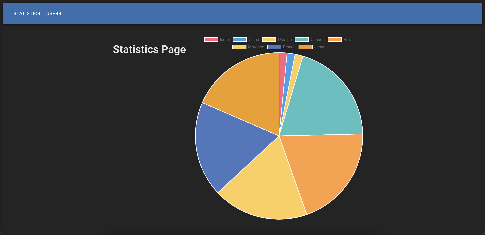

# 👥 Users List App

An interactive React + TypeScript app that lets you manage a dynamic list of users and visualize user statistics. The app supports real-time validation, editing, deletion, error counting, state persistence, and graphical representation of user distribution by country.

Built with [Vite](https://vitejs.dev/), [React](https://react.dev/), [TypeScript](https://www.typescriptlang.org/), and [Context API] for global state management.

---

## 📸 Preview



---

## 🚀 Features

### 📝 Users Management

- Add new users with empty fields (appears at the top).
- Edit name, country, email, and phone inline.
- Delete users from the list.
- Real-time validation with error highlighting.
- Debounced search across all fields.
- Display of total users in the list.
- Field-level error reporting (invalid/empty).
- Disabled save button until errors are fixed.
- Errors automatically cleaned when deleting rows.
- Data persistence in localStorage to survive page reloads.

### 🧪 Validation Rules

Each user has 4 fields: `name`, `country`, `email`, `phone`.  
Validation rules are enforced on every change:

| Field   | Validation Rule |
|--------|------------------|
| Name   | Letters only (`a-z`, case-insensitive) |
| Country | Must be one of the allowed country options |
| Email  | Must contain **exactly one** `@` character |
| Phone  | Must start with **one** `+` character |

> 🔴 Invalid and empty values trigger red input borders.  
> 🟡 Empty fields aren't counted as errors until edited and then cleared.

#### 🧾 Error Summary
Displays total number of:
- Empty fields (after edit)
- Invalid fields

Example:

  Errors: Empty Fields - 0, Invalid Fields - 1

---

### 📈 Statistics Page

- Pie chart showing the number of users per country.
- Automatically reflects latest saved users.
- Fallback: country list + user counts (if charting not available).
- Built with Chart.js.

---

## 🛠 Tech Stack

- React + TypeScript
- Vite
- React Context (global state)
- LocalStorage (data persistence)
- Charting library (e.g., Chart.js or Recharts)

---

## 🧩 Enhancements (using MUI)

- Autocomplete/select input for country selection.
- Loading spinner while user data loads.

---

## 📁 Project Structure

```bash
src/
├── components/
│ ├── UserRow.tsx
│ ├── UserList.tsx
│ ├── ErrorSummary.tsx
│ └── SearchBar.tsx
├── context/
│ └── UsersContext.tsx
├── pages/
│ ├── UsersPage.tsx
│ └── StatisticsPage.tsx
├── utils/
│ └── validation.ts
├── App.tsx
└── main.tsx
```

---

## ▶️ Getting Started

```bash
git clone https://github.com/your-username/users-list-app.git
cd users-list-app
npm install
npm run dev
```

## 👨‍💻 Author

  Built by Daniel Ehrlich as side project.# users-list-app